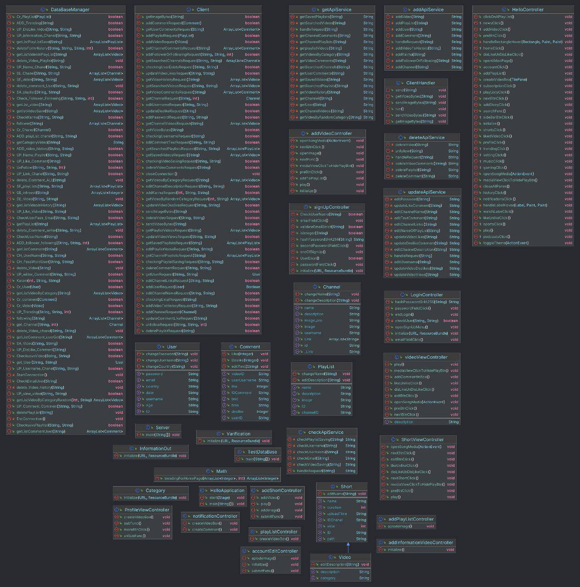

# Youtub-Project

## Introduction
This is the final project of our [**Advanced Programming**](https://github.com/orgs/Advanced-Programming-1402/repositories) course in Shahid Beheshti University. It's a clone of the famous video-streaming application **Youtube** designed using **Java** programming language. 
From [here](), you can acces the project documentation as well.

## Images

## Objectives
Here is a list of concepts which where used through out the project:
- Using OOP concepts
- Database design
- Multithreading concepts
- Socket Programming
- Designing API
- Designing graphical user interface with JavaFX

## Pre Requirements
- JDK 21
- MySQL
- JavaFX
- Gson library
- Maven

## Features
- sign in and sing up
- upload a video
- Displaying videos
- Displaying video descriptions
- create a playlist
- comment to a video
- like and deslike the videos and comments
- save video and playlist
- Displaying history
- Using a server/client architecture

## UML Design

## Implementation
The project has 3 main parts: 
1. `Client`  
2. `Server` 
3. `Sockets`
- `Client`
  This is the package that is considered to be the interface/app layer of the project. It's repsonsible for getting input from a client, sending it through a socket to the server and waiting for a proper response.
- `Server`
  The server is responsible for reading the requests from each clinet, either respoend directly or acces the database using `DBManager` class methods and then, responding back to the client. It's worth noting that the server is multithreaded, which means it can handle dealing with multiple reqeusets as well. Also a server log a printed to the terminal to show what the server is doint at the moment.
- `Sockets`
  It's worth noting that all the data passed between each client and the server is done through the use of sockets. In fact, each request from the client is sent to the socket, then server receives it and responds properly **through the same socket** for each client.

## Creating GUI
The main tool for designing graphical user interface for this project is [JavaFX](https://en.wikipedia.org/wiki/JavaFX).

## Presentation
[This]() is the link to the slides used for project presentation.

## How to run the code?
From branch `product`, clone the repository to your local machine, then, first Configure MySQL in the `DataBaseManager` class and create tables in database and then run the `Server` first, then open `HelloApplication` and run it. Now you are good to go =) .

## Contributers
- Course instructor: [Dr.Saeed Reza Kheradpisheh](https://www.linkedin.com/in/saeed-reza-kheradpisheh-7a0b18155/)
- Project mentor: [Mobin Nesari](https://www.linkedin.com/in/mobin-nesari/)
- Project judge: [Arsham Gholamzadeh](https://www.linkedin.com/in/arsham-khoee/)
- Design:, [Rouzbeh Askary](https://github.com/rouzbeh1384), [Amir Hossein Ziaeifar](https://github.com/amirsalam2004), [Amir Ali Nasiri](https://github.com/amirnasiri23)

## date/time
Spring of 2024 (Version 1.0)

## Resources
- [Extends Class](https://extendsclass.com/)
- [JavaFX tutorial](https://youtube.com/playlist?list=PLxaMIx7eqffLc9mkqFoBFANcZmJVBtzvp)
- [Another JavaFX tutorial](https://youtube.com/playlist?list=PLZPZq0r_RZOM-8vJA3NQFZB7JroDcMwev)